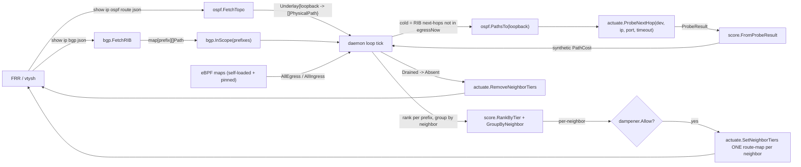

# pathprofiler

**Automatically detect when a network path is degrading and reroute traffic before users notice.**

`pathprofiler` is a Linux daemon that continuously monitors the quality of every path your traffic takes — using eBPF to collect latency, jitter, and retransmit data straight from the kernel — and dynamically reweights BGP/ECMP routes so traffic shifts away from failing paths and onto healthy ones.

No configuration knobs to guess at during an outage. No SSH-ing into boxes to run traceroutes. It sees the problem and acts in seconds.

---

## How it works (in brief)

1. **eBPF probes** in the kernel capture per-flow smoothed RTT (`srtt`), jitter, and retransmit events for every egress and ingress TCP connection — zero userspace packet capture overhead.
2. A userspace daemon polls those eBPF maps, computes a **path health score** (lower = better path) from latency, jitter, and loss proxies, and applies **hysteresis** so transient blips don't flap routes.
3. Each tick, paths are ranked per in-scope prefix: the best path gets the top tier, the runner-up gets the middle tier, and everyone else gets the default. The daemon then rewrites **one BGP route-map per neighbor** (via FRR `vtysh`) to set local-pref on each prefix — **without restarting connections**.
4. A **cold-path prober** periodically tests alternate next-hops (via `SO_BINDTODEVICE` per OSPF underlay interface) so health data exists even for paths that carry no live traffic.

---

## Prerequisites

| Requirement | Minimum |
|---|---|
| Linux kernel | 5.10+ (BPF CO-RE) |
| clang + llvm | 14+ (to compile BPF) |
| libbpf-dev | 1.0+ |
| bpftool | 7.0+ (for `bpftool btf dump`) |
| Go | 1.22+ |
| FRR | 8.x+ |
| `iproute2` | standard |

---

## Install

### 1. Build

```bash
make vmlinux       # generate BPF type definitions from your kernel's BTF
make bpf           # compile eBPF programs
make daemon        # build the Go userspace daemon
```

A single binary, `pathprofiler-daemon`, will be placed at `bin/pathprofiler-daemon`.

### 2. Configure

Create a YAML config (default path: `/etc/pathprofiler.yaml`):

```yaml
scope:
  prefixes: ["192.168.0.0/16"]   # which RIB prefixes to actuate on (CIDR containment filter)

tiers:
  local: 300        # best path per prefix gets this local-pref
  dedicated: 200    # 2nd-best gets this
  default: 100      # everyone else (FRR default)

probe:
  port: 33434
  timeout_seconds: 2
  interval_seconds: 60
```

All optional with sensible defaults. Probe settings can also be set via CLI flags (CLI overrides YAML when set).

### CLI flags

| Flag | Default | Description |
|---|---|---|
| `--config` | `/etc/pathprofiler.yaml` | Path to YAML config |
| `--poll` | `2s` | eBPF map polling interval (passive score cadence) |
| `--min-dwell` | `30s` | Minimum time between actuations per neighbor (anti-flap dampener) |
| `--min-margin` | `0.20` | *(legacy, unused in tier-based design — kept for compatibility)* |
| `--probe-interval` | `0` (use YAML) | Cold-probe + topology-refresh interval in seconds; `0` = use YAML |
| `--probe-port` | `0` (use YAML) | UDP port for cold-path probes; `0` = use YAML |
| `--probe-timeout` | `0` (use YAML) | Cold-probe timeout in seconds; `0` = use YAML |

### 3. Run

```bash
sudo ./bin/pathprofiler-daemon --config /etc/pathprofiler.yaml
```

On startup the daemon will:
- Load BPF programs from embedded prebuilt objects and pin maps to `/sys/fs/bpf/pathprofiler/`
- Attach sockops to the root cgroup, tracepoint to `tcp:tcp_retransmit_skb`, and XDP to gateway interfaces
- Bootstrap `appliedNeighbors` from FRR state (detects any route-maps from a prior daemon instance, so `Drained -> Absent` cleanup survives restarts)
- Fetch the BGP RIB and OSPF underlay
- Begin polling health data and logging per-path scores
- Start the cold-path prober

### Automated install (one-liner)

Or skip all of the above and let the install script do it:

```bash
# Latest release
bash <(curl -fsSL https://raw.githubusercontent.com/ehealth-co-id/pathprofiler/master/scripts/install.sh)

# Specific version
bash <(curl -fsSL https://raw.githubusercontent.com/ehealth-co-id/pathprofiler/master/scripts/install.sh) --version v1.2.3
```

What it does:

1. Detects your architecture (`x86_64` / `aarch64`) and downloads the matching binary + `SHA256SUMS` from the GitHub release.
2. Verifies the checksum before installing.
3. Installs the binary to `/opt/pathprofiler/pathprofiler-daemon`.
4. Drops an example config at `/etc/pathprofiler.yaml` (only if one doesn't already exist).
5. Installs and enables a systemd service (`pathprofiler.service`).
6. Restarts the daemon.

Run as root. Edit the service file or config after installing if you need to tune flags.

---

## How topology is discovered

No static zones or next-hop YAML. Topology is discovered at runtime:

1. **Overlay (BGP):** `vtysh -c "show ip bgp json"` returns the RIB. `scope.prefixes` filters to the prefixes you care about (CIDR containment). Each path has a BGP next-hop and advertising neighbor.
2. **Underlay (OSPF):** `vtysh -c "show ip ospf route json"` resolves each BGP loopback next-hop to its physical underlay paths (interfaces + OSPF next-hops).
3. **Actuation:** Per-neighbor route-maps with multi-sequence numbers actuate local-pref tiers. One route-map per neighbor, rewritten atomically each tick.

---

## Output & observability

The daemon logs structured messages to stdout/stderr. For production use, pipe them into your favourite log shipper:

```
neighbor 10.255.0.3: applied 3 prefix tiers
cold probe 10.255.0.3 via 10.255.0.3 (iface ens21): rtt=2.1ms lost=false
neighbor 10.255.0.4: tier change suppressed by dampener
neighbor 10.255.0.6: removed (drained)
```

---

## Architecture



- **eBPF layer**: Egress SRTT + FIB resolution (`egress_sockops.bpf.c`), retransmit counter (`egress_retrans.bpf.c`), ingress jitter/sequence-gap proxy (`ingress_xdp.bpf.c`). Loaded and pinned by the daemon at startup via `internal/loader`.
- **Scoring layer**: Weighted cost function from latency, jitter, and loss; rank per prefix, group by neighbor.
- **Actuation layer**: Per-neighbor route-maps via `vtysh`. A per-neighbor dampener prevents flapping.
- **Prober**: Sends synthetic probes via `SO_BINDTODEVICE` per underlay interface, so per-leg degradation is detected even without live flows.

---

## Metrics cheat sheet

| Signal | Source | What it tells you |
|---|---|---|
| `srtt_us` | eBPF sock_ops | Smoothed round-trip time (microseconds) |
| Jitter | XDP seq-gap | Inbound path stability |
| Retransmit % | eBPF tracepoint | Fraction of segments retransmitted (loss proxy) |
| Score | Computed | Lower = healthier path |
| Confidence | Computed | How many samples support the score |

---

## Troubleshooting

**"load bpf: ... open egress_map ..."**
-> The daemon could not load or pin BPF maps. Ensure `/sys/fs/bpf` is mounted (`mount -t bpf bpf /sys/fs/bpf`), the kernel supports BPF (5.10+ with BTF), and the daemon has `CAP_BPF` + `CAP_NET_ADMIN` (granted by the systemd unit). Run `bpftool feature probe` to verify CO-RE and helper availability.

**Daemon runs but never switches paths**
-> Check the logs for the most common reasons: (a) only one path exists for all prefixes (nothing to switch to), (b) the dampener is suppressing changes (`tier change suppressed by dampener`), or (c) cold probes haven't completed yet (`cold probe ...` lines). A neighbor with only one in-scope prefix is intentionally pinned to `default` — it will be actuated once a competing path appears.

**Cold-probe replies are not arriving**
-> Verify `SO_BINDTODEVICE` is allowed (kernel 5.10+, `CAP_NET_RAW`), and check that `rp_filter` isn't dropping probe replies on the return path.

**FRR actuation fails**
-> Ensure `vtysh` is accessible to the user running the daemon (sudo, or add the user to the `frr` group). The daemon shells out to `vtysh`.

---

## Known limitations

- **Per-underlay-path probe results are averaged per neighbor for v1 actuation.** OSPF-ECMP produces multiple probe results per BGP neighbor (one per underlay interface). These are averaged into a single PathCost per neighbor before ranking. Per-leg actuation (draining only the degraded ECMP leg) is a future enhancement.
- **`LoopbackForPhysicalNH` assumes physical-NH-to-loopback uniqueness.** The reverse lookup from OSPF physical next-hop to BGP loopback assumes a 1:1 mapping. This holds in the current deployment but is not a general guarantee. On ambiguity, the function returns an error rather than silently misattributing traffic.
- **Per-neighbor dampener couples sibling prefixes.** The dampener is keyed per-neighbor (forced by Phase 5's neighbor-atomic route-map actuation). Prefix A's legitimate tier change on neighbor X is suppressed if prefix B (sharing neighbor X) flapped recently. This is a conscious trade-off: partial route-map rewrite is not possible with FRR's one-route-map-per-neighbor-per-direction model.

---

## Out of scope / known gaps

These items are pre-existing or out of scope:

1. **Byte-order bug.** `bpf/common.h:9` says "host byte order"; `bpf/egress_sockops.bpf.c:81` stores network order. Centralized in `uint32ToIPStr` with a trip-wire test, but not fixed.
2. **`bytes_acked` not wired in BPF.** `score.Compute` falls back to raw retransmit count.
3. **Probe echo target.** Default port 33434 (discard) gives ICMP port-unreachable, which still measures RTT. A real echo target is a follow-up.

---

## Project layout

```
bpf/              eBPF C sources (compiled with clang -target bpf)
cmd/daemon/       Go daemon entrypoint (linux-only)
internal/loader/  BPF program loader, pinning, and attachment
internal/maps/    eBPF map readers (cilium/ebpf)
internal/score/   Path cost computation + ranking + hysteresis
internal/actuate/ Routing actuation + cold-path prober
internal/bgp/     BGP RIB parser (vtysh json)
internal/ospf/    OSPF topology parser (vtysh json)
internal/netutil/ Device/path resolver (ip route get + OSPF)
internal/config/  YAML config parser (scope/tiers/probe)
scripts/          Install script, systemd unit, example config
```

---

## License

MIT
